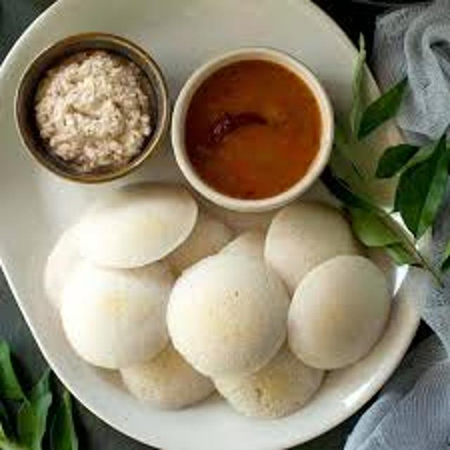
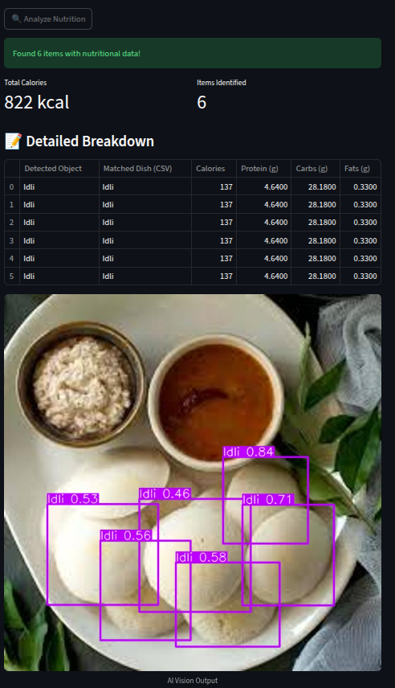

# 🍛 SmartPlate: AI-Powered Nutrition Assistant


**SmartPlate** is an end-to-end Computer Vision application designed to automate dietary tracking. Unlike generic calorie counters, this project utilizes **Transfer Learning** on the YOLOv8 architecture to specifically detect and recognize **Indian cuisine**, mapping detected items to a custom nutritional database in real-time.

---

## 📸 Demo & Screenshots

### 1. Real-Time Detection & Analysis
*The system detects the food item (e.g., Avial) and retrieves the corresponding macronutrients.*

 
*(Replace 'your_avial_image.jpg' with the actual filename of your working screenshot)*

### 2. Detailed Nutritional Breakdown
*A pandas-based breakdown of Calories, Protein, Carbs, and Fats.*


*(Replace 'your_results_image.jpg' with the screenshot of the table output)*

---

## 🚀 Key Features

* **Custom Object Detection:** Fine-tuned **YOLOv8** model trained on a custom dataset of Indian foods.
* **Intelligent Mapping:** Robust string-matching logic to map detected classes (CV output) to a nutritional CSV database.
* **Interactive Web App:** User-friendly interface built with **Streamlit** allowing image uploads and instant analysis.
* **Error Handling:** "Graceful failure" mechanisms that guide users when non-food items or unknown dishes are detected.

---

## 🛠️ Tech Stack

* **Deep Learning:** YOLOv8 (Ultralytics), PyTorch
* **Web Framework:** Streamlit
* **Data Manipulation:** Pandas, NumPy
* **Image Processing:** PIL (Python Imaging Library), OpenCV
* **Version Control:** Git & GitHub

---

## 📂 Project Structure

```
AI Nutrition Assistant/
├── datasets/                # Dataset directory
│   └── food_dataset/        # Custom Indian food images & labels
├── app.py                   # Main Streamlit application
├── nutrition_data.py        # Logic for CSV parsing and data retrieval
├── nutrition_info.csv       # Database of food items and macros
├── train_model.py           # Script for training/fine-tuning YOLOv8
├── requirements.txt         # Project dependencies
└── README.md                # Documentation
```
**Arijeet Dutta**
Engineer
Email : arijeetdutta501@gmail.com
[LinkedIn](https://www.linkedin.com/in/arijeetd/)